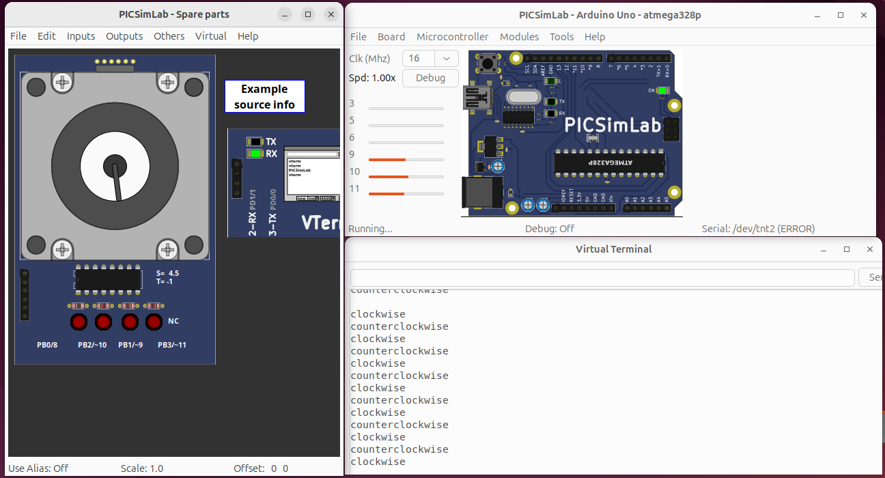
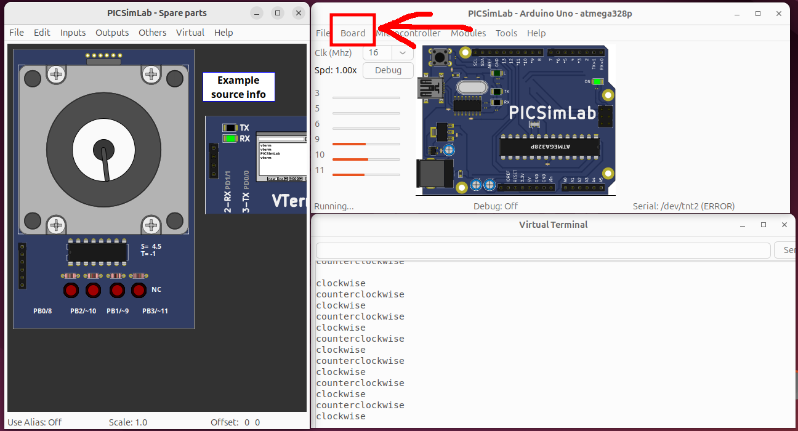
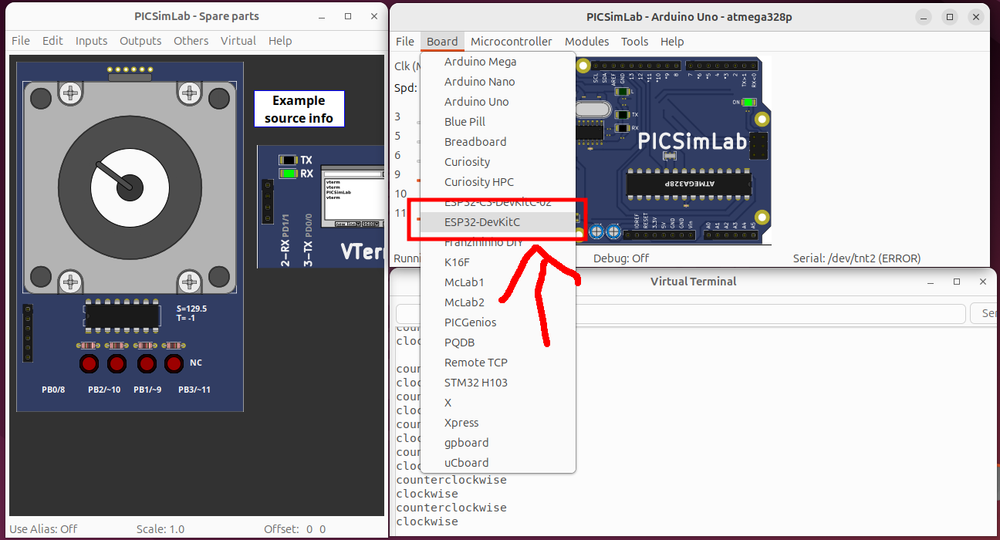
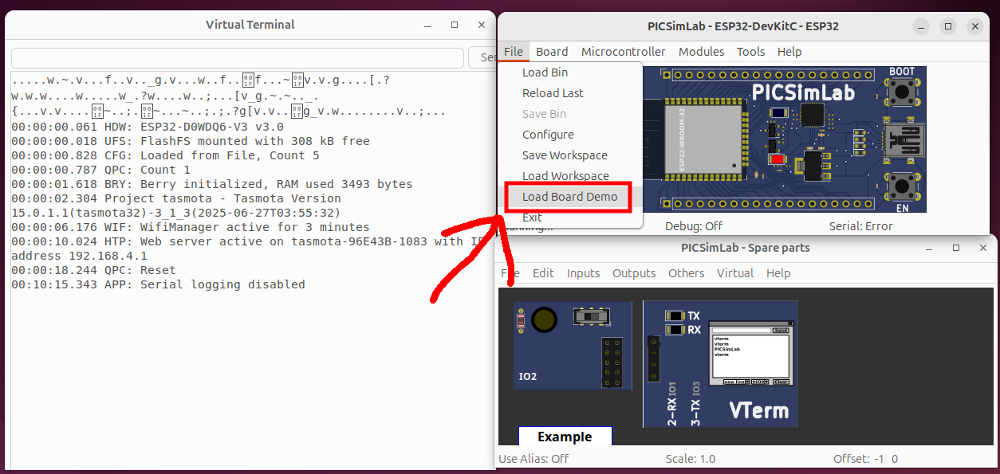
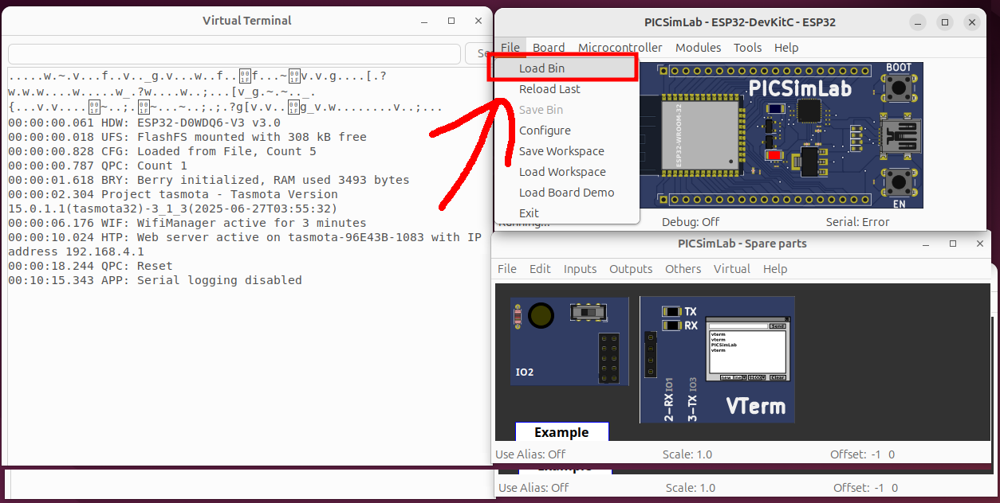
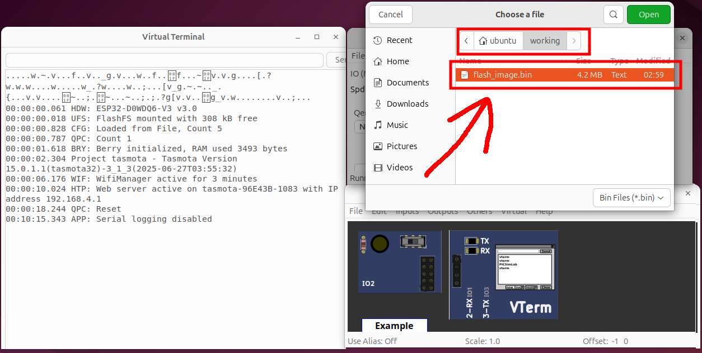
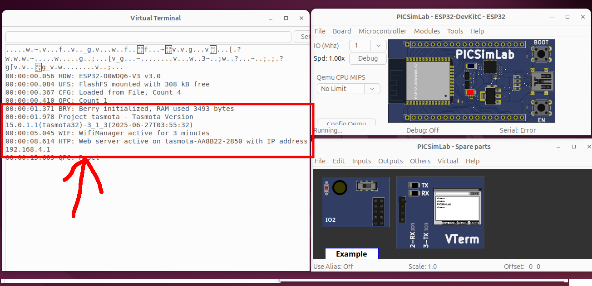

# Tasmota ESP32 Emulation with QEMU

This project emulates the Tasmota ESP32 firmware using the ESP32-capable fork of QEMU provided by Espressif. The goal is to create a reproducible environment for running and testing Tasmota firmware in a virtualized setup, without the need for physical hardware.

---

## Project Overview

1. Install Ubuntu 24.04 in a virtual machine or other supported environment  
2. Install required build dependencies  
3. Download and install the Espressif ESP-IDF (`idf.py`)  
4. Clone and compile the picsimlab fork of QEMU  
5. Download and build Tasmota firmware for ESP32  
6. Emulate the firmware using QEMU  

---

## Prerequisites

- A system running **Ubuntu 24.04** (VM, WSL2, or bare metal)
- Internet access

---

## Step 1: Install Ubuntu 24.04

Use a virtualization platform such as VirtualBox, VMware, KVM, or WSL2 to install a clean copy of **Ubuntu 24.04**. A minimum of 4GB RAM and 2 CPU cores is recommended.

### After installation, update the system:

<pre>sudo apt update 
sudo apt upgrade -y 
</pre>

### Install Git:

<pre>sudo apt install -y git 
</pre>

---

## Step 2: Install Build Dependencies

Install all required packages for building QEMU and supporting tools. These are based on the official documentation:

- [Espressif QEMU Toolchain Guide](https://docs.espressif.com/projects/esp-idf/en/stable/esp32/api-guides/tools/qemu.html)  
- [QEMU Build Environment Guide](https://www.qemu.org/docs/master/devel/build-environment.html)  
- [ESP-IDF Toolchain Setup](https://docs.espressif.com/projects/esp-idf/en/stable/esp32/api-guides/tools/idf-py.html)
- [ESP32 Embedded System Testing]https://alexconesa.wordpress.com/2025/01/17/speeding-up-esp32-embedded-system-testing-with-qemu-on-ubuntu/

<pre>sudo apt update 
sudo apt upgrade -y 

sudo apt install -y \
  binwalk build-essential cmake ccache dfu-util git git-email acpica-tools libaio-dev \
  libbluetooth-dev libbrlapi-dev libbz2-dev libcacard-dev libcap-ng-dev \
  libcapstone-dev libcbor-dev libcups2-dev libcurl4-gnutls-dev libdaxctl-dev \
  libffi-dev libfdt-dev libgcrypt20 libgcrypt20-dev libglib2.0-0t64 \
  libglib2.0-dev libgtk-3-dev libibverbs-dev libiscsi-dev libjpeg-dev \
  libkeyutils-dev liblzo2-dev libnettle8t64 \
  libncurses-dev libnfs-dev libnuma-dev libpam0g-dev libpixman-1-0 \
  libpixman-1-dev libpmem-dev librbd-dev librdmacm-dev libsasl2-dev \
  libsdl2-2.0-0 libsdl2-dev libseccomp-dev libslirp-dev libslirp0 \
  libsnappy-dev libssh-dev libssl-dev libusb-1.0-0 libusb-1.0-0-dev \
  libusbredirparser-dev libvde-dev libvdeplug-dev \
  libvte-2.91-dev libxen-dev libzstd-dev linux-libc-dev meson ninja-build \
  platformio sphinx-doc valgrind xfslibs-dev iw
  
sudo apt install -y \
  clang python3 python3-pip python3-sphinx python3-setuptools \
  python-is-python3 python3-venv python3-sphinx-rtd-theme \
  libspice-server-dev libpulse-dev libvncserver-dev libxrandr-dev \
  libxfixes-dev libxinerama-dev libxext-dev libx11-dev libxcb1-dev \
  libxkbcommon-dev libdrm-dev libsdl2-image-dev libgtk-4-dev \
  libopus-dev libzstd-dev lzop
  
  export DEBIAN_FRONTEND=noninteractive
  echo "wireshark-common wireshark-common/install-setuid boolean true" | sudo debconf-set-selections
  sudo apt-get install -y wireshark 
</pre>

---

## Step 3: Install the Espressif ESP-IDF

ESP-IDF is Espressif’s official development framework used for formatting and flashing firmware to ESP32 devices.

Reference: https://docs.espressif.com/projects/esp-idf/en/stable/esp32/api-guides/tools/idf-py.html

<pre>cd ~ 
git clone --recursive https://github.com/espressif/esp-idf.git
cd esp-idf
./install.sh
</pre>

---

## Step 4: Start ESP-IDF Environment

This command must be run in each new terminal session before using Espressif tools.

<pre>cd ~ 
cd esp-idf
. export.sh
</pre>

---

## Step 5: Clone and Build the Picsimlab Fork of QEMU

This fork of QEMU is used to run Tasmota firmware and allows the device to boot. However, during testing, the firmware’s web interface was inaccessible. Possible reasons:

1. Tasmota’s HTTP server typically relies on Wi-Fi. Since the ESP32 Wi-Fi stack is proprietary, full support may not be available in picsimlab.
2. Tasmota defaults to Wi-Fi Access Point (AP) mode. Since QEMU forks generally cannot emulate an ESP32 Wi-Fi AP, it may be possible to reconfigure Tasmota to connect to an existing access point instead. This would require firmware modifications, which are discussed later.

Reference: https://lcgamboa.github.io/

<pre>cd ~ 
git clone --depth=1 https://github.com/lcgamboa/picsimlab.git
cd picsimlab
bscripts/build_all_and_install.sh
</pre>

*After installing Picsimlab, close the GUI and continue.*

---

## Step 6: Set Up PlatformIO

PlatformIO is used to build the Tasmota firmware.

Reference: https://tasmota.github.io/docs/PlatformIO-CLI/

<pre>cd ~
virtualenv platformio-core
cd platformio-core
. bin/activate
pip install -U platformio
pip install --upgrade pip
</pre>

---

## Step 7: Build the Tasmota Firmware

 This downloads and compiles the smart home firmware source. 
 Specifically the tasmota32 variant which works with QEMU.  
 Ensure the ESP-IDF environment is active (`. ./export.sh`) before building.

 Reference: https://tasmota.github.io/docs/Compile-your-build/#defining-multiple-custom-firmwares

<pre>cd ~/platformio-core
git clone https://github.com/arendst/Tasmota.git
cd Tasmota
rm -rf .pio
pio run -t clean
pio run -e tasmota32
deactivate
</pre>

---

## Step 8: Merge Binary Files

Combines bootloader, partitions, and firmware into a single image for QEMU.  
 Make sure the ESP-IDF environment is still active.

<pre>cd ~ 
mkdir -p working
cd working
esptool.py --chip esp32 merge_bin \
  --fill-flash-size 4MB \
  --flash_mode dio \
  --flash_freq 40m \
  --flash_size 4MB \
  -o flash_image.bin \
  0x1000  ~/platformio-core/Tasmota/.pio/build/tasmota32/bootloader.bin \
  0x8000  ~/platformio-core/Tasmota/.pio/build/tasmota32/partitions.bin \
  0xe000  ~/.platformio/packages/framework-arduinoespressif32/tools/partitions/boot_app0.bin \
  0x10000 ~/platformio-core/Tasmota/variants/tasmota/tasmota32-safeboot.bin \
  0xe0000 ~/platformio-core/Tasmota/.pio/build/tasmota32/firmware.bin
</pre>

---

## Step 9: Load Firmware into Picsimlab

Start Picsimlab:

<pre>cd ~ 
cd working 
picsimlab 
</pre>

When picsimlab starts up, the GUI will look like the following. 
 

Then follow these steps in the GUI:

1. Open the **Board** tab  
     
2. Select **ESP32-DevKitC**  
     
3. Open the **File** tab → **Load Board Demo**  
     
4. Open the **File** tab → **Load Bin**  
     
5. Select the `flash_image.bin` binary that was created and saved in the ~/working folder. 
   

Once loaded, Tasmota should run and the Terminal can be used to run the 
command line interface commands. 

 Command reference: https://tasmota.github.io/docs/Commands/#control

---

## ************************************  
## *** Optional Content: Section 1  ***  
## ************************************

### Alternative QEMU Fork (Not Fully Functional)

This Espressif QEMU fork supports Tasmota loading but lacks Wi-Fi support, resulting in boot loops.

Build instructions:  
https://github.com/espressif/esp-toolchain-docs/tree/main/qemu/esp32

## Step 1 Clone and Build the Espressif Fork of QEMU
<pre>cd ~ 
git clone https://github.com/espressif/qemu.git
cd qemu
./configure --target-list=xtensa-softmmu \
    --enable-gcrypt \
    --enable-slirp \
    --enable-debug \
    --enable-sdl \
    --disable-strip --disable-user \
    --disable-capstone --disable-vnc \
    --disable-gtk
ninja -C build
</pre>

## Step 2 Clone and Build the Espressif Fork of QEMU
## Assuming that Tasmota has already been built and the esptool.py was used to 
## cerate the binary and run the Tasmota project in the Espressif Fork of QEMU
<pre>cd ~ 
cd working

~/qemu/build/qemu-system-xtensa -nographic -M esp32 \
   -m 4M -drive file=flash_image.bin,format=raw,if=mtd \
   -global driver=esp32.spi_flash,property=drive,value=flash \
   -global driver=timer.esp32.timg,property=wdt_disable,value=true \
   -nic user,model=open_eth -display sdl 
</pre>

---

## ************************************  
## *** Optional Content: Section 2  ***  
## ************************************

### Install QEMU for ARM Targets

<pre>
sudo apt install -y qemu-system-arm qemu-system-aarch64 qemu-utils curl
</pre>

### Running Home Assistant (Raspberry Pi Image)

Download and uncompress Home Assistant OS image for Raspberry Pi:

<pre>cd ~ 
mkdir -p homeAssistant
cd homeAssistant

wget https://github.com/home-assistant/operating-system/releases/download/11.5/haos_rpi4-11.5.img.xz
xz -d haos_rpi4-11.5.img.xz
</pre>

### Convert the binary into a QEMU accepted format 

<pre>
qemu-img convert -f raw -O qcow2 haos_rpi4-11.5.img haos_rpi4.qcow2
</pre>

### Run the HomeAssistant in QEMU

Not working at the moment
<pre>
qemu-system-aarch64 \
  -M virt -cpu cortex-a72 -m 2048 \
  -drive file=haos_rpi4.qcow2,format=qcow2,if=virtio \
  -netdev user,id=net0,hostfwd=tcp::8123-:8123 \
  -device virtio-net-device,netdev=net0 \
  -nographic
</pre>

### Determine that the web page is accessable

In another terminal than the one running QEMU
<pre>
</pre>

### Run a HTTP Fuzzer 

In another terminal than the one running QEMU
<pre>
</pre>

### Check for HTTP server crashes

In the QEMU terminal, use the journal system to check for HTTP server 
crashes

<pre>
</pre>